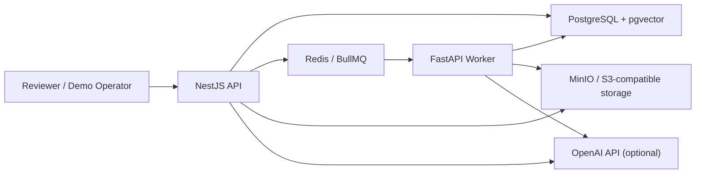

# System Overview

## What this repo contains

- `services/api`
  - NestJS API for auth, RBAC, KB membership-scoped access, uploads, retrieval, grounded chat, evals, and operator endpoints
- `services/worker`
  - FastAPI ingestion worker for fetch, parse, normalize, chunk, embed, and chunk persistence
- `packages/shared-types`
  - shared TypeScript enums and queue payload contracts
- `infra/compose`
  - infra-only compose and full demo-stack compose

## Runtime shape

## Observability

Operational logging, health/readiness, stage timings, and metrics extension points are documented in [observability.md](./observability.md).

## Review-relevant flows

### Ingestion

1. Authenticated user uploads a file to the API.
2. API writes metadata rows and stores the file in object storage.
3. API enqueues an ingest job in Redis/BullMQ.
4. Worker consumes the job, parses the file, normalizes text, chunks it, optionally embeds it, and replaces stored chunks transactionally.
5. API document detail endpoints reflect status, chunk count, attempts, and errors.

### Retrieval and chat

1. User asks a KB-scoped question.
2. API verifies KB membership scope or explicit admin override.
3. API runs hybrid retrieval over lexical and semantic candidates.
4. API assembles a grounded prompt from selected chunks only.
5. API persists the assistant answer, citations, usage, and retrieval metadata.

OpenAI behavior is intentionally bounded:

- query embeddings fail closed into lexical-only retrieval
- grounded answer generation never runs without explicit retrieval context
- missing API keys disable only the OpenAI-dependent features instead of crashing the app

### Evals and ops

1. Admin or operator creates an eval set and runs it through the real retrieval/chat path.
2. API stores per-item results, summary metrics, and regression comparison against the previous run.
3. Admin or operator inspects failed jobs, retries a single job, and checks health and metrics endpoints.

## Deployment modes

- Local dev:
  - infra via `infra/compose/docker-compose.yml`
  - API and worker run on the host with `pnpm` and `uvicorn`
- Demo deployment:
  - full stack via `infra/compose/docker-compose.demo.yml`
  - includes one-shot migration and demo seed bootstrap

## Demo seed shape

The demo bootstrap creates:

- system roles if missing
- demo admin, editor, and viewer users
- one archived-safe, owner-scoped knowledge base with stable slug
- one small smoke eval set and case

It does not preload documents. Reviewers still upload a document before retrieval and eval flows become meaningful.

## Known constraints

- OpenAI is required for grounded answer generation.
- Semantic retrieval degrades to lexical-only when embeddings are disabled or unavailable.
- OCR is not implemented.
- Retrieval has a deterministic in-process hybrid reranker, but no model-based cross-encoder reranker or query rewrite layer.
- Citations are answer-level only in v1; there is no sentence-level evidence alignment.
- Metrics are in-process counters/histograms with an optional export hook; distributed tracing is not wired to OpenTelemetry yet. See [observability.md](./observability.md).
- KB visibility is not used as an authorization bypass for document, retrieval, or chat access.

See [OpenAI Integration](./openai-integration.md) for the provider contract, error codes, and fallback modes.

For the database entity map, lifecycle rules, and migration/index rationale, see [Schema Notes](./schema.md).
