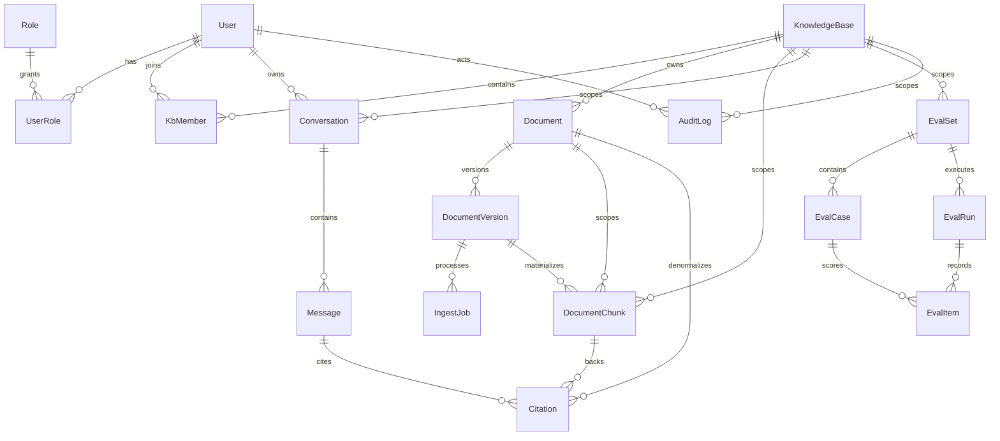

# Database Schema Notes

This document captures the intended database shape for the AI knowledge base / support copilot backend.

The stack uses:

- PostgreSQL
- `pgvector`
- Prisma ORM and Prisma Client
- hand-authored Prisma SQL migrations

## Migration Strategy

The source of truth is split intentionally:

- `services/api/prisma/schema.prisma`
  - application-facing model contract
- `services/api/prisma/migrations`
  - deployable DDL history

### Baseline and ordering

The migration chain now starts with a core foundation migration before the phase-specific additions. This matters because later migrations alter tables that must already exist.

### Enum evolution

Enums are treated as additive-only in place.

Safe changes:

- add enum values with `ALTER TYPE ... ADD VALUE`

Unsafe changes that need a replacement type:

- renaming enum values
- removing enum values
- collapsing multiple enum values into one

For those cases, create a new enum type, cast the column, backfill, switch defaults, then drop the old type later.

### Verification

Use `pnpm run db:verify` to:

- create an isolated temporary schema
- apply migrations from scratch
- run seeds twice
- assert DB-level uniqueness, FK, and delete-restrict behavior

The verifier depends on a reachable PostgreSQL instance at the configured `DATABASE_URL`.

## Entity Overview

## Core Decisions

### Auth and RBAC

- `users.email` is case-insensitive unique via `CITEXT`
- `users.status` is explicit and required
- `roles.name` stays enum-backed for stable querying
- `user_roles` uses a composite PK to prevent duplicates
- `refresh_sessions.tokenHash` is unique

### Knowledge bases

- KBs now have a stable `slug`
- KB lifecycle is archival, not hard delete
- KB access paths filter to `status = ACTIVE`
- ownership is still membership-based through `kb_members.role = OWNER`

The schema does not try to enforce “at least one owner” with a trigger. That remains an application invariant because it is easier to evolve safely there than in cross-row DB logic.

### Documents and versions

- documents and versions remain separate
- document status stays explicit
- document versions keep `versionNumber` for content versions and `ingestVersion` for reindex attempts on the same content version
- `storageBucket` is tracked on `DocumentVersion` so object location is not implicit in environment config alone

### Chunks and citations

- active chunk uniqueness is enforced with a partial unique index on `(documentVersionId, chunkNo)` where `supersededAt IS NULL`
- reindexing supersedes old active chunks instead of deleting them
- citations still point to real chunk rows, including historical superseded rows
- composite consistency FKs ensure:
  - chunk `(documentVersionId, documentId)` matches a real version/document pair
  - chunk `(documentId, kbId)` matches a real document/KB pair
  - citation `(chunkId, documentId)` matches a real chunk/document pair

### Evals

- `EvalRun.kbId` now has a direct FK to `KnowledgeBase`
- a composite FK on `(evalSetId, kbId)` prevents eval runs from drifting outside the eval set’s KB scope
- `EvalCase.expectedSourceDocumentId` is now a real optional FK

## Indexing Rationale

Hot-path indexes that matter:

- `users.email`
  - login lookup
- `KbMember(userId, kbId)`
  - KB membership auth checks
- `Document(kbId, createdAt DESC)`
  - document list by KB
- `Document(kbId, status, createdAt DESC)`
  - document list by KB and status
- `IngestJob(documentVersionId, createdAt DESC)`
  - latest job for a version
- partial `IngestJob` failed-terminal index on finished/update time
  - failed jobs operator views without paying full write cost on every state
- partial active chunk uniqueness and active chunk lookup indexes
  - retrieval and reindex safety
- partial active FTS GIN on `DocumentChunk.searchText`
  - lexical retrieval ignores superseded chunks
- `AuditLog(actorId, createdAt DESC)`, `AuditLog(action, createdAt DESC)`, `AuditLog(entityType, entityId, createdAt DESC)`
  - audit investigations
- `EvalItem(evalRunId, createdAt)`
  - run detail pages

Indexes intentionally omitted:

- no generic ANN vector index yet
  - the chunk table records multiple embedding models/dimensions
  - a single global ANN index would either be wrong or would lock the schema to one embedding shape
- no extra indexes on JSON columns
  - query paths do not justify them yet
- no extra `user_roles(roleId)` index
  - current reads are user-centric, not role-centric

## Cascade and Restrict Rules

Use `CASCADE` only for rows that are truly subordinate and disposable:

- `user_roles`
- `kb_members`
- `refresh_sessions`
- `messages -> citations`

Use `RESTRICT` where hard delete would erase traceability or break scope history:

- `knowledge_bases -> documents`
- `knowledge_bases -> conversations`
- `knowledge_bases -> eval_sets`
- `documents -> document_versions`
- `document_versions -> ingest_jobs`
- `conversations -> users`
- `citations -> chunks/documents`

Use `SET NULL` where the historical row should survive even if the actor entity is removed:

- `audit_logs.actorId`
- `audit_logs.kbId`

Practical implication:

- archive KBs instead of deleting them
- archive or supersede retrieval material instead of deleting cited evidence
- disable users instead of deleting them when chat/audit history must remain intact

## Vector and Search Design

Vector safety rules:

- `pgvector` is installed by migration
- each chunk records `embeddingModel` and `embeddingDim`
- DB checks require `embedding`, `embeddingModel`, and `embeddingDim` to be present together
- DB checks also require `vector_dims(embedding) = embeddingDim`

Retrieval rules:

- semantic retrieval filters on KB, active chunks, indexed document/version, embedding model, and embedding dimension
- lexical retrieval uses a partial active GIN index on `to_tsvector('simple', searchText)`

Embedding model upgrades:

- keep old chunks for citation history
- reindex into a new active chunk set
- filter queries by model and dimension so mixed embeddings do not silently compare

## Lifecycle Notes

- KBs are archived through `KnowledgeBase.status` and `archivedAt`
- documents already have an explicit `ARCHIVED` status
- old chunks are retained with `supersededAt`
- failed ingest jobs are kept for operator review and audit
- eval runs/items are retained for regression history
- audit log retention is a policy decision outside the schema; the schema is built to preserve the history safely
- conversation retention is also a policy decision; the schema now avoids user hard deletes that would cascade chat history away

## Future-Safe Evolution Areas

Likely next schema steps, if the product grows:

- model-scoped ANN indexes once embedding model/dimension are standardized enough to justify them
- explicit archival APIs for documents and conversations
- a first-class document source enum once non-upload sources exist
- optional created-by / archived-by attribution columns on KBs and documents if audit queries need that without joining logs
